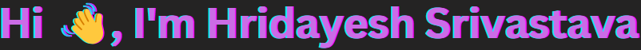

.gif)
 
<!--<h1 align="center">Hi 👋, I'm Hridayesh Srivastava</h1>-->
<!--
  
-->

  

  

  

 

    

• I'm eager to embark on a career where I can apply my knowledge and contribute to industry of Computer Science and Engineering in the field of making websites.  
• I am poised to learn and grow in a professional setting. I am committed to making a positive impact and eager to seize opportunities for growth and development.  
• I'm currently learning and working with: **HTML5,CSS3,JavaScript ES6,React.js,Next.js14,Node.js,Express.js,MongoDB,Git,GitHub,Bootstrap 5,Figma Designs**

• 📫 How to reach me: **hrideshsrivastavaa@outlook.com**
 

  

 

  

<h3 align="left">Connect with me:</h3> 

<h3 align="left">Languages and Tools:</h3>

             

  

 

 
   

  

   
  
  

   

   
  
  

   

  

 

&nbsp;

   

  

  

 

 

  

